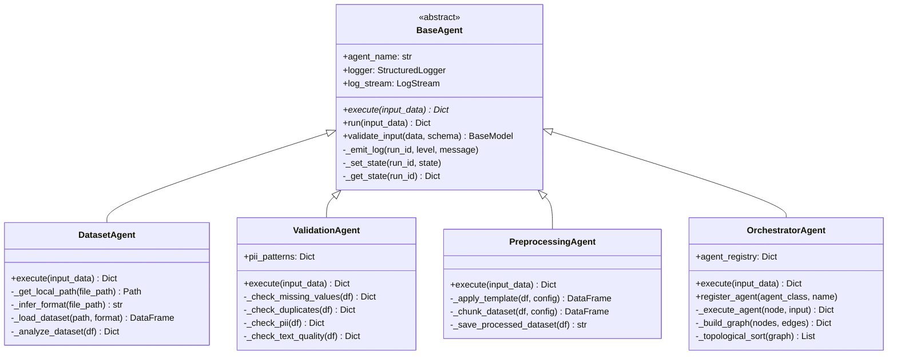

# LLM Fine-Tuning Platform - Complete Documentation

## Table of Contents
1. [System Overview](#system-overview)
2. [Architecture](#architecture)
3. [Component Details](#component-details)
4. [Data Flow](#data-flow)
5. [API Reference](#api-reference)
6. [Deployment Guide](#deployment-guide)
7. [Development Guide](#development-guide)

---

## System Overview

### What is This Platform?

An **industry-scale, agent-based backend system** that enables users to fine-tune Large Language Models (LLMs) through visual drag-and-drop pipelines with real-time monitoring.

### Key Features

- 🎯 **Drag-and-Drop Pipelines**: Visual configuration of training workflows
- 🔄 **Agent-Based Architecture**: Modular, stateless execution units
- 📊 **Real-Time Monitoring**: Live training logs via Server-Sent Events
- 🚀 **GPU-Accelerated**: Automatic GPU detection with CPU fallback
- 💾 **Object Storage**: S3-compatible storage for datasets and models
- 🔁 **Fault Tolerant**: Automatic retries with exponential backoff
- 📦 **Docker-Ready**: Complete containerized deployment

### Use Cases

1. **Fine-tune LLMs** on custom datasets (LoRA, QLoRA, Full)
2. **Validate datasets** for quality and PII detection
3. **Preprocess text** with LLM-native cleaning and formatting
4. **Evaluate models** with task-specific metrics
5. **Export models** in multiple formats (adapters, merged, GGUF)

---

## Architecture

### High-Level Architecture


### System Components

#### 1. **Client Layer**
- Web UI or API clients
- Submits pipeline configurations
- Consumes real-time logs via SSE

#### 2. **API Layer**
- **FastAPI Application**: REST API endpoints
- **SSE Endpoint**: Real-time log streaming
- **CORS Middleware**: Cross-origin support
- **Exception Handlers**: Structured error responses

#### 3. **Orchestration Layer**
- **Orchestrator Agent**: DAG execution engine
- **Task Queue (RQ)**: Background job management
- **Redis**: Job state and message queue

#### 4. **Agent Layer**
- **Dataset Agent**: File ingestion and analysis
- **Validation Agent**: Data quality checks
- **Preprocessing Agent**: LLM-native text processing
- **Training Agent**: Model fine-tuning
- **Evaluation Agent**: Metric computation
- **Export Agent**: Model export in multiple formats

#### 5. **Infrastructure Layer**
- **Redis**: State, queue, log streaming
- **PostgreSQL**: Metadata persistence
- **MinIO**: S3-compatible object storage
- **GPU Manager**: Device allocation and monitoring

#### 6. **Worker Layer**
- **GPU Workers**: Execute training jobs
- **CPU Workers**: Execute non-GPU tasks
- **Auto-scaling**: Add workers as needed

---

## Component Details

### Agent Framework

#### Base Agent Architecture



#### Agent Lifecycle


---

## Data Flow

### Complete Pipeline Flow


### Dataset Agent Flow


### Validation Agent Flow


### Preprocessing Agent Flow


### Real-Time Log Streaming Flow


---

## Infrastructure Details

### Redis Architecture


### Object Storage (MinIO) Structure


### GPU Management Flow


---

## API Reference

### Endpoint Structure

```mermaid
graph LR
    ROOT[/] --> HEALTH[/health]
    ROOT --> API[/api/v1]
    
    API --> JOBS[/jobs]
    API --> DATASETS[/datasets]
    API --> MODELS[/models]
    API --> LOGS[/logs]
    
    JOBS --> J1[POST /jobs]
    JOBS --> J2[GET /jobs/:id]
    JOBS --> J3[DELETE /jobs/:id]
    
    DATASETS --> D1[POST /datasets/upload]
    DATASETS --> D2[GET /datasets/:id]
    
    MODELS --> M1[GET /models]
    MODELS --> M2[GET /models/:id]
    MODELS --> M3[GET /models/:id/download]
    
    LOGS --> L1[GET /logs/stream/:run_id]
    LOGS --> L2[GET /logs/history/:run_id]
    
    style ROOT fill:#e3f2fd
    style API fill:#fff9c4
```

### Request/Response Flow

```mermaid
sequenceDiagram
    participant Client
    participant API
    participant Validator
    participant Queue
    participant Redis
    
    Client->>API: POST /api/v1/jobs
    Note over Client,API: {pipeline_config}
    
    API->>Validator: Validate Schema
    Validator-->>API: Valid ✓
    
    API->>Queue: Enqueue Job
    Queue-->>API: job_id
    
    API->>Redis: Set Job State
    Redis-->>API: OK
    
    API-->>Client: 202 Accepted
    Note over API,Client: {job_id, status: pending}
    
    Client->>API: GET /api/v1/jobs/:id
    API->>Redis: Get Job State
    Redis-->>API: {status, progress}
    API-->>Client: 200 OK
```



---

## Deployment Guide

### Docker Compose Deployment

```mermaid
graph TB
    subgraph "Docker Host"
        subgraph "llm-platform Network"
            REDIS_C[redis:6379]
            POSTGRES_C[postgres:5432]
            MINIO_C[minio:9000/9001]
            API_C[api:8000]
            WORKER_C[worker]
        end
        
        subgraph "Volumes"
            V1[redis_data]
            V2[postgres_data]
            V3[minio_data]
        end
        
        subgraph "GPU"
            GPU_DEV[/dev/nvidia0]
        end
    end
    
    REDIS_C --> V1
    POSTGRES_C --> V2
    MINIO_C --> V3
    WORKER_C --> GPU_DEV
    
    API_C --> REDIS_C
    API_C --> POSTGRES_C
    API_C --> MINIO_C
    
    WORKER_C --> REDIS_C
    WORKER_C --> POSTGRES_C
    WORKER_C --> MINIO_C
    
    style REDIS_C fill:#ffebee
    style POSTGRES_C fill:#e3f2fd
    style MINIO_C fill:#e8f5e9
    style API_C fill:#fff9c4
    style WORKER_C fill:#f3e5f5
```

### Deployment Steps


---

## Development Guide

### Local Development Setup


### Testing Strategy


---

## Performance & Scaling

### Horizontal Scaling


### Performance Metrics


---

## Security Considerations

### Security Layers


---

## Troubleshooting

### Common Issues Flow

```mermaid
flowchart TD
    ISSUE[Issue Reported] --> TYPE{Issue Type?}
    
    TYPE -->|Connection| CONN[Check Services]
    TYPE -->|Performance| PERF[Check Resources]
    TYPE -->|Error| ERR[Check Logs]
    
    CONN --> C1{Redis Up?}
    C1 -->|No| FIX1[Restart Redis]
    C1 -->|Yes| C2{MinIO Up?}
    C2 -->|No| FIX2[Restart MinIO]
    C2 -->|Yes| C3[Check Network]
    
    PERF --> P1{GPU Available?}
    P1 -->|No| FIX3[Check nvidia-docker]
    P1 -->|Yes| P2{Memory OK?}
    P2 -->|No| FIX4[Scale Workers]
    P2 -->|Yes| P3[Optimize Config]
    
    ERR --> E1[View Container Logs]
    E1 --> E2[Check Redis Logs]
    E2 --> E3[Check Worker Logs]
    E3 --> FIX5[Fix Root Cause]
    
    FIX1 --> VERIFY[Verify Fix]
    FIX2 --> VERIFY
    FIX3 --> VERIFY
    FIX4 --> VERIFY
    FIX5 --> VERIFY
    C3 --> VERIFY
    P3 --> VERIFY
    
    VERIFY --> RESOLVED([Issue Resolved])
    
    style ISSUE fill:#ffcdd2
    style RESOLVED fill:#c8e6c9
```

---

## Summary

This documentation provides a complete overview of the LLM Fine-Tuning Platform, including:

✅ **Architecture Diagrams** - High-level and component-level views  
✅ **Flow Diagrams** - Data flow, agent lifecycle, deployment  
✅ **Sequence Diagrams** - Request/response, log streaming  
✅ **Component Details** - Class diagrams, infrastructure  
✅ **API Reference** - Endpoint structure and flows  
✅ **Deployment Guide** - Docker setup and steps  
✅ **Development Guide** - Local setup and testing  
✅ **Performance & Scaling** - Horizontal scaling strategies  
✅ **Security** - Multi-layer security approach  
✅ **Troubleshooting** - Common issues and solutions

For more details, see:
- [README.md](./README.md) - Quick start guide
- [walkthrough.md](../walkthrough.md) - Implementation details
- [API Documentation](http://localhost:8000/docs) - Interactive API docs
