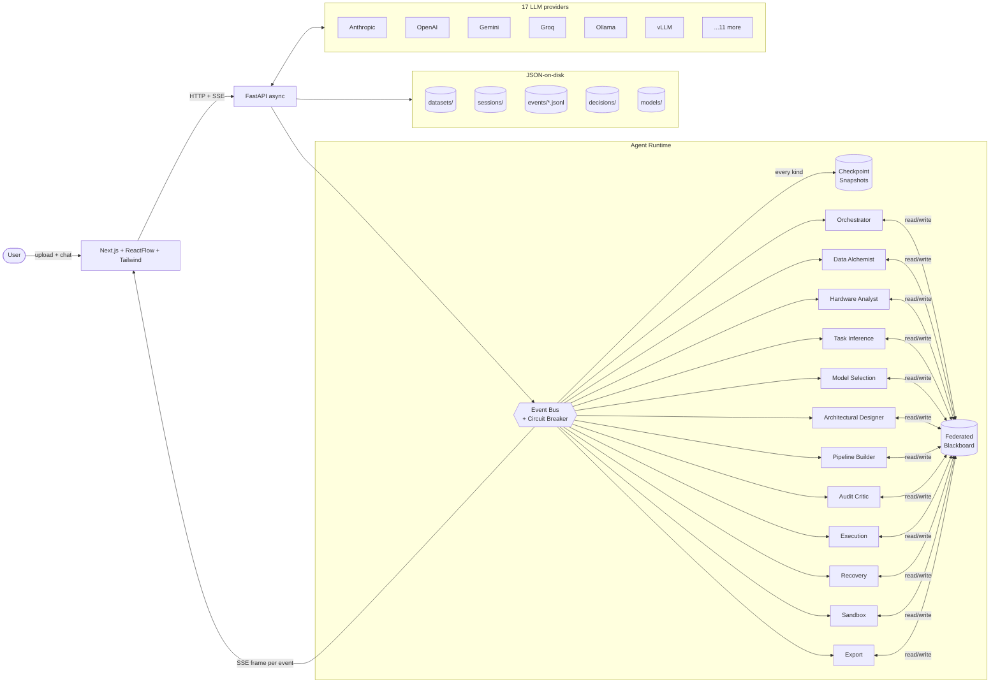

<div align="center">

# FineTune Studio

### The autonomous, agentic, no-code studio for LLM fine-tuning.

**Drop a folder of crap data. Get fortune-grade weights.**
A self-healing hierarchical agent swarm reads your hardware, profiles your dataset,
asks Socratic questions, drafts a SOTA-2026 pipeline (DoRA, GaLore, Unsloth, DPO),
trains it, recovers from failure, benchmarks in a sandbox, and pushes to Hugging Face —
all in one prompt, all live-streamed, all open source.

[](LICENSE)
[](https://www.python.org)
[](https://nextjs.org)
[](https://fastapi.tiangolo.com)
[](#contributing)
[](https://github.com/tanish-24-git/finetune-studio/stargazers)

[**Quickstart**](#quickstart) - [**Why it's different**](#why-its-different) - [**Architecture**](#architecture) - [**Agent personas**](#the-socratic-agent-swarm) - [**Roadmap**](#roadmap) - [**Contribute**](#contributing)

</div>

---

## The 30-second pitch

```
$  drag dataset into the canvas

[thinking]   Probing hardware - 12GB VRAM, no MPS, CUDA 12.4
[planning]   1. Profile  2. Health-check  3. Rank models  4. Train
[asking]     I see 30% duplicates. Merge or treat as separate domains?
[executing]  step 240/720 - loss 1.7841 - 4.2 tok/ms
[garnishing] popping `train` node onto the canvas...
[done]       18m total - adapter pushed to user/my-trained-model
```

That entire transcript is **streamed live** from the backend over Server-Sent Events
into a ReactFlow canvas. The agent narrates everything in five colour-coded
tones - `[thinking]`, `[planning]`, `[asking]`, `[garnishing]`, `[executing]` -
because the blueprint mandates **deep interactivity**, not loading spinners.

> **No Redis. No external database. No telemetry. No lock-in.**
> A single `docker compose up` boots the entire studio on your laptop.

---

## Why it's different

Most fine-tuning tools are *static pipelines*: you fill out a form, press a button,
hope the loss curve doesn't NaN. FineTune Studio is built around **a self-healing
hierarchical swarm of 19 specialized agents** that *consult* you instead of *commanding* you.

| Concern | Other tools | **FineTune Studio** |
| --- | --- | --- |
| Runs locally | via Docker only | pure Python + Node, optional Docker |
| Multi-agent runtime | single LLM call | 19 agents on an event bus, federated blackboard |
| Asks before risky decisions | silent failures | Socratic gating with confidence thresholds |
| Streams the agent's *reasoning* | black box | `[thinking]` / `[planning]` events over SSE |
| SOTA-2026 PEFT stack | LoRA only | **DoRA, GaLore, Unsloth fusions, DPO/ORPO** |
| Crash recovery | start over | TAO loop, `checkpoint.json`, circuit breaker |
| Sandbox eval after training | trust the loss | clean-room benchmark suite (MMLU/GSM8K/HumanEval lite) |
| Provider lock-in | usually | **17 providers** out of the box |
| Data alchemy | manual | deep recursive scan, schema induction, semantic dedup, PII redact |

---

## The Socratic agent swarm

Nineteen agents, one event bus, one cognitive workspace. Each agent has a
single job and posts its work to the **Federated Blackboard** so the others
can pick up where it left off - no agent ever calls another directly.

| Agent | Role | Triggered by |
| --- | --- | --- |
| **OrchestratorAgent** | Voice of the studio. Greets, broadcasts the master plan, surfaces overrides. | `SessionStarted`, `AuditOverride` |
| **DatasetIntakeAgent** | First-pass file inspection. | `DatasetUploaded` |
| **DatasetProfilingAgent** | Token distribution, duplicates, missing values, class balance. | `IntakeCompleted` |
| **DataAlchemistAgent** | Grades data health, surfaces blocking issues, asks Socratic questions. | `DatasetProfileCompleted` |
| **HardwareAnalysisAgent** | Detects device, VRAM, throughput. | `DatasetUploaded` |
| **TaskInferenceAgent** | Classifies task type from buckets and imbalance. | `DatasetProfileCompleted`, `UserClarificationReceived` |
| **ConfidenceGate** | Routes low-confidence task inference to clarification. | `TaskInferred` |
| **ClarificationAgent** | Picks the smallest useful question from the catalog. | `IntentConfidenceLow` |
| **ModelSelectionAgent** | Ranks base models against `(hardware * profile * task)`. | `HardwareProfileCompleted`, `PipelineDraftRequested` |
| **TrainingStrategyAgent** | The Architectural Designer - picks SOTA-2026 stack with rationale. | `CandidateModelsRanked` |
| **PipelineBuilderAgent** | Generates pipeline + node graph and *garnishes* nodes one-by-one. | `StrategyChosen` |
| **ApprovalGate** | Auto-approves short jobs; otherwise asks. | `PipelineDraftCreated` |
| **AuditAgent** *(Critic)* | Independent reviewer of every plan. Vetoes high-risk decisions. | `DatasetProfileCompleted`, `StrategyChosen`, `PipelineDraftCreated`, `RecoveryPlanGenerated` |
| **ExecutionAgent** | Starts the training job after approval. | `PipelineApproved` |
| **TrainingMonitorAgent** | Watches metrics, detects anomalies. | `TrainingMetricUpdated`, `PipelineExecutionStarted` |
| **RecoveryAgent** | TAO loop. Proposes plan diffs at L1/L2/L3 severity. | `TrainingAnomalyDetected`, `RetryApproved` |
| **EvaluationAgent** | Post-training metrics + baseline delta. | `TrainingCompleted` |
| **InferenceSandboxAgent** | Clean-room benchmarks (MMLU / GSM8K / HumanEval lite). | `EvaluationCompleted` |
| **ExportAgent** | Save local, push to HF, or both - only after explicit user choice. | `EvaluationCompleted`, `SaveLocalRequested`, `PushToHFRequested` |

### The 10 Behavioral Commandments

1. **Never assume hardware.** Always probe before recommending.
2. **Consult, don't command.** Decisions with >20% quality impact ask first.
3. **Be transparent.** If the agent is thinking, it says exactly what about.
4. **Data is king.** If the data is garbage, stop and notify before wasting compute.
5. **No hallucinations.** Tool failure is admitted, not faked.
6. **Efficiency first.** Prefer Unsloth + DoRA over full-parameter tuning.
7. **Explain the *why*.** Every loss curve comes with an explanation.
8. **Security always.** Auto-redact API keys, emails, phone numbers, AWS keys.
9. **Incremental success.** A "clean dataset" is value even before training.
10. **One-prompt mastery.** Aim to complete the mission from a single command.

---

## Architecture


```mermaid
flowchart LR
    U([User]) -- upload + chat --> FE[Next.js + ReactFlow + Tailwind]
    FE -- HTTP + SSE --> API[FastAPI async]

    subgraph Runtime [Agent Runtime]
        BUS{{Event Bus<br/>+ Circuit Breaker}}
        BB[(Federated<br/>Blackboard)]
        CKPT[(Checkpoint<br/>Snapshots)]

        BUS --> O[Orchestrator]
        BUS --> DA[Data Alchemist]
        BUS --> HA[Hardware Analyst]
        BUS --> TI[Task Inference]
        BUS --> MS[Model Selection]
        BUS --> TS[Architectural Designer]
        BUS --> PB[Pipeline Builder]
        BUS --> AU[Audit Critic]
        BUS --> EX[Execution]
        BUS --> RC[Recovery]
        BUS --> SB[Sandbox]
        BUS --> XP[Export]

        O & DA & HA & TI & MS & TS & PB & AU & EX & RC & SB & XP <-->|read/write| BB
        BUS -->|every kind| CKPT
    end

    API --> BUS
    BUS -- SSE frame per event --> FE

    subgraph Storage [JSON-on-disk]
        DS[(datasets/)]
        SES[(sessions/)]
        EVT[(events/*.jsonl)]
        DEC[(decisions/)]
        MOD[(models/)]
    end
    API --> Storage

    subgraph Providers [17 LLM providers]
        Anthropic
        OpenAI
        Gemini
        Groq
        Ollama
        vLLM
        Etc[...11 more]
    end
    API <--> Providers
```

**Operational properties.**

| Property | Implementation |
| --- | --- |
| Single-process | Pure asyncio. No Redis, no Celery, no background queues. |
| Crash-survivable | Every event is appended to `data/events/<session>.jsonl`; checkpoints flushed on every state-bearing event. |
| Replay-correct | Reload a session by replaying its event log; agents are deterministic given the same blackboard. |
| Loop-safe | `CircuitBreaker` trips after `N=12` events of the same kind in a 30s window and fans `CircuitBreakerTripped` to the UI. |
| Slow-consumer-safe | SSE queues drop frames when full; the replay endpoint covers backlog. |
| Tool-typed | Every agent action is a registered `tool(...)` with a JSON schema and side-effect class (`read` / `write_session` / `write_resource` / `external`). |

---

## SOTA-2026 training stack

The **Architectural Designer** picks dynamically from the modern PEFT toolbox.
Every choice comes back with a `rationale: string[]` so the UI can explain *why*.

| Variant | When chosen | Why |
| --- | --- | --- |
| **DoRA** (weight-decomposed) | quality priority, >=1B params, GPU available | Decouples magnitude and direction - sharper updates with no inference cost |
| **GaLore** (gradient low-rank projection) | full-parameter requested but VRAM tight | Full-parameter learning that fits on prosumer GPUs |
| **Unsloth fused kernels** | CUDA + bf16/fp16 + LoRA family | Up to 70% VRAM savings; doubles batch size |
| **QLoRA + int4** | <8GB VRAM and >1B params | Forced quantization to even fit in memory |
| **DPO / ORPO alignment** | user opts in | Preference optimization without a separate reward model |

### TAO recovery ladder (Think -> Act -> Observe)

| Level | Trigger | Agent action |
| --- | --- | --- |
| **L1 - Retry** | network timeout, rate limit | exponential backoff resume from checkpoint |
| **L2 - Adapt** | OOM, NaN loss, divergence, spike | mutate config (LR, batch, seq, grad checkpointing) and retry |
| **L3 - Escalate** | data corruption, hardware failure | stop and produce a diagnostic report for the user |

---

## What you'll see

| Layer | Behavior |
| --- | --- |
| **Stage header** | `Live - Profiling Dataset - conf 72%` - pulses green while the bus is healthy. |
| **Story tab** | Cards: assistant messages, clarification asks, pipeline draft, approval prompt, training metrics, sandbox benchmarks. |
| **Cognition tab** | Five-colour stream: thinking, planning, asking, garnishing, executing. |
| **Pipeline canvas** | ReactFlow nodes "pop" in with a glow as the agent garnishes them. Hover for the agent's thought bubble. |
| **Run log** | Collapsible internal-event tail (tool calls, decision records). |
| **Audit override** | `Audit override - [Critic veto]` - surfaces blocking critiques as a modal-style chat bubble. |

---

## Security posture

Built for teams that can't ship data to a third-party agent.

- **Encrypted at rest** - API keys are Fernet-encrypted; the symmetric key auto-generates on first run.
- **Auto-redaction** - `alchemy.redact_sensitive` strips emails, phone numbers, IPv4, AWS keys, RSA private blocks, and bearer tokens during ingestion.
- **No telemetry** - there is no `telemetry.py` and no `phone-home` URL anywhere. Grep the repo.
- **Tool boundary** - every agent declares `allowed_tools`; calls to anything else are returned as a structured error, never silent.
- **Side-effect classes** - `read` / `write_session` / `write_resource` / `external` so policies can gate dangerous tools.

---

## Quickstart

### One-liner with Docker

```bash
git clone https://github.com/tanish-24-git/finetune-studio.git
cd finetune-studio
cp backend/.env.example backend/.env       # paste your LLM_API_KEY (optional)
docker compose up --build
```

Frontend at <http://localhost:3000>, backend docs at <http://localhost:8000/docs>.

### Local Python + Node (recommended for dev)

```bash
# 1. Backend
cd backend
python -m venv .venv && .venv/Scripts/Activate.ps1   # or `source .venv/bin/activate`
pip install -r requirements.txt
cp .env.example .env
python -m uvicorn app.main:app --reload

# 2. Frontend (new terminal)
cd frontend
npm install
npm run dev
```

### First run

1. Open <http://localhost:3000>. The setup wizard guides you through provider + key + model.
2. Drop a CSV / JSON / JSONL file in the left rail.
3. Watch the agent stream `[thinking]` -> `[planning]` -> `[garnishing]` -> `[executing]` in the right panel.
4. Approve the pipeline draft, get coffee.
5. Choose **local** / **HuggingFace** / **both** for export.

---

## Running on free-tier API keys

The defaults are tuned to survive a single Gemini Flash free-tier key
(5 RPM, 250k TPM) end-to-end on a small dataset. The two systems that
make this work are:

- A **provider rate-limit gate** that serializes every LLM HTTP call
  (probe, intake, loop, recovery) per provider, so independent agents
  cannot collectively burst past the cap.
- A **rolling context window** in the AgenticLoop that keeps the
  prompt size flat across long runs — older turns collapse into a
  short note rather than accumulating until they break TPM.

For heavier work, three knobs (all optional, all zero-config by default):

| Knob | Default | Purpose |
| --- | --- | --- |
| `GEMINI_API_KEYS=k1,k2,k3` (plural) | unset | Round-robin across multiple keys; each gets its own RPM/TPM bucket. Same shape works for any provider: `GROQ_API_KEYS`, `OPENROUTER_API_KEYS`, etc. A generic `LLM_API_KEYS` is also honored. |
| `data/provider_limits.json` | auto-seeded on first run | Per-provider `rpm` / `tpm` / `min_interval_sec`. Edit any time; re-read on every reservation. |
| `FT_ROLLING_WINDOW_K` | `8` | How many recent assistant+tool-result pairs the loop keeps verbatim. Lower it to reduce TPM further; raise it for richer long-range context on bigger tiers. |
| `FT_OBSERVATION_BUDGET` | `2000` | Per-tool-output character cap applied centrally in the registry. Tools that self-manage size (`web_fetch`, `extract_raw_text`) opt out. |
| `TAVILY_API_KEY` | unset | If present, the web-search tool tries Tavily first (cleaner markdown, survives bot-detection) before the zero-config DuckDuckGo / Google / SearXNG / Wikipedia chain. |

Heavier dataset, paid key, or a fleet of free keys — you only need to
set what applies. Nothing here is mandatory.

---

## HTTP API surface

| Method | Path | Purpose |
| --- | --- | --- |
| `POST` | `/api/datasets/upload` | Upload + start a session |
| `GET` | `/api/sessions` | List sessions |
| `GET` | `/api/sessions/{id}` | Session detail (artifacts, FSM state) |
| `GET` | `/api/sessions/{id}/events` | **SSE stream** of every event |
| `POST` | `/api/sessions/{id}/messages` | Free-text user message |
| `POST` | `/api/sessions/{id}/clarifications/{qid}` | Answer a Socratic question |
| `POST` | `/api/sessions/{id}/approve` | Approve / reject pipeline draft |
| `POST` | `/api/sessions/{id}/export` | Submit export choice |
| `POST` | `/api/sessions/{id}/retry` | Approve / deny a recovery diff |
| `POST` | `/api/sessions/{id}/cancel` | Hard cancel |
| `GET` | `/api/sessions/{id}/audit` | Decision-log dump |
| `GET` | `/api/sessions/{id}/blackboard` | Federated blackboard contents |
| `GET` | `/api/sessions/{id}/checkpoint` | Latest checkpoint snapshot |
| `GET` | `/api/tools` | Tool registry introspection |

---

## Repo layout

```
backend/                FastAPI - async - file-based JSON store
  app/
    agents/             19 specialized agents (the swarm)
    api/                routes + Pydantic schemas
    events/             bus - types - jsonl event log
    orchestration/      confidence thresholds + policies
    services/           blackboard - checkpoint - session - pipeline - jobs
    tools/              17 registered tool families (alchemy, sandbox, ...)
    utils/              config - crypto - hardware probe
  data/                 sessions, events, blackboards, checkpoints (created on first run)
  requirements.txt

frontend/               Next.js 14 - React 18 - Tailwind - ReactFlow
  src/
    app/                App Router pages: /, /setup, /playground, /test, /settings
    components/         AgentActivity - SocraticStream - PipelineCanvas - ...
    lib/                api - types - sse hook - cn helper

docs/                   Detailed documentation (see below)
```

---

## Detailed documentation

| Topic | File |
| --- | --- |
| Quick start | [docs/QUICKSTART.md](docs/QUICKSTART.md) |
| Run with Docker | [docs/DOCKER.md](docs/DOCKER.md) |
| Configuration variables | [docs/CONFIGURATION.md](docs/CONFIGURATION.md) |
| Architecture deep-dive | [docs/ARCHITECTURE.md](docs/ARCHITECTURE.md) |
| HTTP API reference | [docs/API.md](docs/API.md) |
| Agents, tools, providers | [docs/AGENTS.md](docs/AGENTS.md) |
| Inference endpoints | [docs/INFERENCE.md](docs/INFERENCE.md) |
| Pipelines and jobs | [docs/PIPELINES.md](docs/PIPELINES.md) |
| Troubleshooting | [docs/TROUBLESHOOTING.md](docs/TROUBLESHOOTING.md) |

---

## Roadmap

- [x] Multi-agent runtime (19 agents, event bus, federated blackboard)
- [x] Socratic streaming (thinking / planning / asking / garnishing / executing)
- [x] DoRA, GaLore, Unsloth, DPO/ORPO selection
- [x] TAO recovery ladder (L1/L2/L3)
- [x] Sandbox post-training benchmarks
- [x] Circuit breaker + checkpointing
- [ ] Distributed runtime (Redis bus, multi-node fan-out)
- [ ] Visual agent graph editor in the playground
- [ ] FSDP / DeepSpeed adapters for big-iron training
- [ ] Vector-store-backed long-term memory across sessions
- [ ] First-class Mac MPS path with Metal kernels

PRs that move the needle on any of these win a permanent shoutout in the README.

---

## Contributing

We're aiming to be one of the most-starred open-source LLM-training tools on GitHub.
That means **issues are first-class citizens** - open one for any rough edge, and one of
the agents (or one of us) will look at it.

```bash
# fork + clone, then:
git checkout -b feature/your-thing
cd backend && python -m pytest                # tests must pass
cd ../frontend && npm run typecheck && npm run lint
git commit -am "feat: ..."
git push origin feature/your-thing
```

**Guides we follow:**
- One agent = one file. New agent? Add it to `app/agents/wiring.py`.
- One tool = one decorated function. New tool? Add it to `app/tools/__init__.py`.
- New event kind? Update `app/events/types.py`, the SSE listener in
  `frontend/src/lib/sse.ts`, and `frontend/src/lib/types.ts`.
- Frontend changes always go through `cn`, never inline class concatenation.

---

## Star history

If FineTune Studio saved you a weekend, please leave a star. Stars are the only
attention-economy signal we listen to.

[](https://star-history.com/#tanish-24-git/finetune-studio&Date)

---

## License

Apache-2.0. Use it. Fork it. Ship it. Print it on a t-shirt.

> *"Turn any crap data into fortune model weights, in one prompt."*
> - the FineTune Studio Master Blueprint
