# 🚀 LLM Fine-Tuning Platform

> **Enterprise-Grade | AI-Assisted | Multi-Container | Production-Ready**

<div align="center">

[](https://python.org)
[](https://fastapi.tiangolo.com)
[](https://pytorch.org)
[](https://www.docker.com/)
[](https://kubernetes.io/)
[](https://redis.io)
[](https://min.io)
[](https://reactjs.org)

</div>

<br />

An industrial-scale platform for fine-tuning Large Language Models. Features **real-time AI assistance**, autonomous agent orchestration, and distinct container isolation for CPU/GPU workloads. Designed for scale, observability, and zero-code operation.

---

## ⚡ Workflow Architecture

```mermaid
graph LR
    subgraph "Frontend Layer"
        UI[💻 NoCode UI]
        CLI[📟 CLI Tool]
    end

    subgraph "Orchestration Layer"
        API[⚡ API Gateway]
        ORCH[🎼 Agent Orchestrator]
        AI[🧠 AI Assistant]
    end

    subgraph "Compute Layer (GPU)"
        TRAIN[🔥 Training Agent]
        EVAL[⚖️ Evaluation Agent]
        EXPORT[📦 Export Agent]
    end

    subgraph "Storage Layer"
        REDIS[(Redis Streams)]
        MINIO[(MinIO Object Store)]
    end

    UI --> API
    API --> ORCH
    ORCH <--> AI
    ORCH --> TRAIN
    TRAIN --> REDIS
    TRAIN --> MINIO
    TRAIN --> EVAL
    EVAL --> EXPORT
    
    style UI fill:#1E293B,stroke:#334155,color:#fff
    style API fill:#0F172A,stroke:#3B82F6,color:#fff,stroke-width:2px
    style TRAIN fill:#4C1D95,stroke:#8B5CF6,color:#fff,stroke-width:2px
    style AI fill:#059669,stroke:#10B981,color:#fff
    style REDIS fill:#991B1B,stroke:#EF4444,color:#fff
```



## ✨ Core Features

### 🧠 Intelligent Orchestration
- **Autonomous Agents**: Dedicated agents for dataset ingestion, validation, preprocessing, training, evaluation, and export.
- **AI Copilot**: Integrated TinyLlama assistant suggests optimal hyperparameters (epochs, batch size, LoRA rank) based on your specific dataset.
- **DAG Execution**: Complex dependency graphs managed automatically.

### 🔥 Advanced Training Engine
- **Multi-Method Support**: Full Fine-Tuning, LoRA (Low-Rank Adaptation), and QLoRA (4-bit Quantization).
- **Hardware Agnostic**: Seamlessly switches between CPU and NVIDIA GPU modes.
- **Real-Time Observability**: Live loss curves and metrics streamed via Server-Sent Events (SSE).

### 🛡️ Enterprise Infrastructure
- **Container Isolation**: Dedicated microservices for API, Workers, Inference, and Storage.
- **Kubernetes Ready**: Full suite of production manifests (StatefulSets, HPA, ConfigMaps).
- **Secure by Design**: Role-based access, JWT auth, and isolated compute environments.

---

## 🚀 Quick Start

### 1. Initialize System
```bash
# Clone and setup environment
git clone <repo-url>
cd NoCode-Back
cp .env.example .env

# Launch the platform (Starts 7 services)
docker-compose up -d
```

### 2. Verify Deployment
```bash
# Check service health
curl http://localhost:8000/health

# Access Interfaces
# 🖥️ Frontend: http://localhost:3000
# 📄 API Docs: http://localhost:8000/docs
# 🗄️ MinIO:    http://localhost:9001 (admin/minioadmin)
```

---

## 📦 System Components

| Service | Port | Description |
|---------|------|-------------|
| **Frontend** | `3000` | Modern React/Vite Dashboard |
| **API Gateway** | `8000` | FastAPI Orchestration Layer |
| **GPU Worker** | `N/A` | Background Training Consumers |
| **TinyLlama** | `8001` | Base Model Inference Engine |
| **AI Assistant** | `8002` | Ollama-based Helper |
| **Redis** | `6379` | Message Broker & Cache |
| **MinIO** | `9000` | S3-Compatible Storage |

## 📁 Agent Directory

```
app/agents/
├── base_agent.py          # Abstract logic
├── orchestrator.py        # Graph execution
├── dataset_agent.py       # Ingestion & Validation
├── preprocessing_agent.py # Tokenization & Chunking
├── training_agent.py      # PyTorch/LoRA Trainer
├── evaluation_agent.py    # F1/ROUGE Metrics
└── export_agent.py        # Safetensors/GGUF Conversion
```

---

## 🛠️ Development

### Local Setup (No Docker)
```bash
# Install dependencies
pip install -r requirements.txt

# Start dependencies
redis-server &
minio server /data &

# Run API
python -m app.main
```

### Testing
```bash
# Run full suite
pytest tests/ -v

# Generate coverage
pytest --cov=app
```
